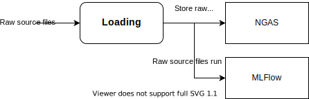
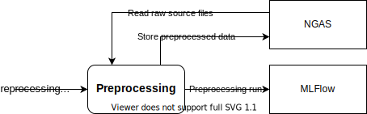
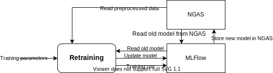
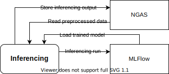

# Machine Learning Pipeline

## Components
### [MLFlow](https://www.mlflow.org/docs/latest/index.html)
Stores runs containing information about previously executed ML tasks (e.g. data loading, training, inference),
and stores trained ML models for inferencing.

### [NGAS](https://github.com/ICRAR/ngas)
Provides a storage mechanism for MLFlow to store data and models. Requires Docker.

### [DALIUGE](https://github.com/ICRAR/daliuge)
Executes data loading, training, and inference workflows.

## Tasks
Atomic tasks that accept input from one or more Components, and produce outputs
that are consumed by other Components.

These will be composed together as components in a DALIUGE workflows.
### Load Raw Source Files
Load source files onto the NGAS server.
- Inputs
  - Raw source files
- Outputs
  - Raw source files (NGAS)
  - Raw source files run (MLFlow)

### Preprocess Raw Source Files
Preprocess a set of loaded source files, from NGAS, and store them back on NGAS.
- Inputs
  - Raw source files (NGAS)
  - Preprocess settings
- Outputs
  - Preprocessed files (NGAS)
  - Preprocess files run (MLFLow)

### Train Model
Take a set of preprocessed data and produce a model from it.
- Input
  - Preprocessed files (NGAS)
  - Model train parameters
- Output
  - Trained model (MLFlow)
  - Training run (MLFlow)

### Retrain Model
Take a model, train it on more data, and produce a new model from it.
- Input
  - Trained model (MLFlow)
  - Preprocessed files (NGAS)
  - Model train parameters
- Output
  - Trained model (MLFlow)
  - Training run (MLFlow)

### Inferencing
Take a trained model and a set of preprocessed data and produce an inference output from it
- Input
  - Preprocessed files (NGAS)
  - Trained model (MLFlow)
- Output
  - Inferencing Output (NGAS)
  - Inferencing run (MLFlow)

## Web server
Results generated via inferencing or training should be accessible via a web server.
This server will be publicly accessible and will serve files from the MLFlow runs or NGAS server.

## Notes
- MLFlow can support writing artifacts to different types of backend storage, we can probably set it up to use NGAS as a backend.
- MLFlow stores models with versioning, so we can update an existing model with re-trained versions, and all downstream inferencing tasks will use the updated model automatically.
- This repository will contain all the setup scripts needed to fully build and deploy the server.
- Training will need to support being performed as a slurm job.
- Reading any files from the MLFLow/NGAS server will need to check a local cache server first. 
  - If the file is found in the cache, it should not be downloaded again.
  - If the cached file is out of date, it should only be requested from the server if the user is not using a bad connection (i.e. Kevin at home).
- The individual tasks that are used by DALIUGE will need to be executable directly as scripts (so we can run them on our own computers as we need), or via some sort of worker that can submit a slurm task to a supercomputer and upload the results.
- For the BOM work at least, inferencing tasks need to be submitted automatically as new data is available via an FTP server.
  - The model will probably need to be re-trained regularly too.

## TODO
- Document setup process and create server setup for
  - Docker
  - NGAS
  - Daliuge
- Investigate creating an NGAS storage backend for MLFlow
- Create skeleton python scripts to perform each of the tasks
- Install and investigate using Daliuge to create the task graphs